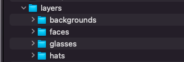
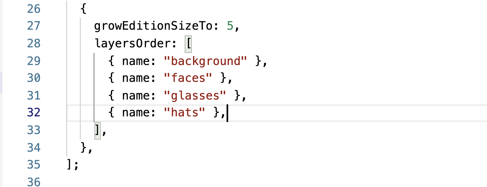
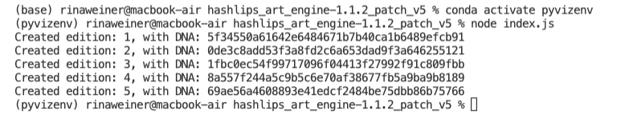
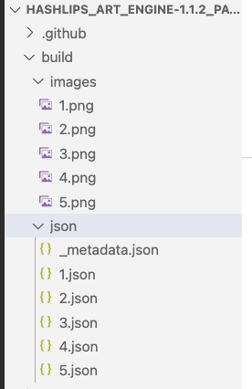

# NFT - Digital Art


> Non-Fungible Tokens Art- Copybara 


### Table of Contents
Our project was divided into three sections.

- [Art Creation & Code](#art-creation-code)
- [Piñata - IPSF](#Piñata_IPSF)
- [Contract & Deployment](#Contract)
- [How To Use](#how-to-use)
- [References](#references)
- [License](#license)
- [Author Info](#author-info)

---

## Art Creation & Code
[Art Creation & Code](#art-creation-code)

We developed our concept and determined how many layers we were adding to our Copybara. We utilized Canvas to design the layers and format them appropriately. We saved each layer in a separate folder which was then incorporated in the code by matching the name of our folders with our code.





•	Once the code was synced, we ran a test run of 5 combination bur running node index.js which yielded the 5 creations along with its unique identifier or DNA.


 

•	The unique images are saved in a build folder. The images are placed in one folder an the corresponding .json files are saved in another.It's worth noting that the _metadata.json file is created as a backup which stores all of the images created. 




•	Metadata is particularly important in creating NFT’s it is the image’s information, it contains information such as the name, description, image ipsf, DNA, edition attributes. This information will be displayed on OpenSea attributes. 

•	We assigned a weighted number to each file in the attributes folder by adding #Number to the end of each file name to give rarity to those colors, objects that are more unique than others. For example, in our faces folder we gave each color a weight of 8 (brown),10(coffee),10(moss),3(rose),1(white),10(yellow) for a total of 42. This means that the white one will appear 1 out of 47 times or  2.12%. This percentage is actually listed on OpenSea. 


•	To create unique images in this collection, we used the utilities under the “utils” folder by running the Rarity Data code:

```
node utils/rarityData.js
```

•	We also ran the Preview Collage code under the utility folder by running:

```
node createPreviewCollage.js
```


•	In addition to creating unique images we wanted to shuffle the order in which the images would appear and in order to do so we, in he const function below we set the shuffle configuration to true.


•	Good to know: if you accidentally delete the metadata.js folder there is a utility that will regenerate/recover that folder called regenerate Metadata.js by running:

```
node utils/regenerateMetadata.js
``` 

Please note that this only works if the Metadata.js folder is deleted. 

•	Pixelate.js will take your current images and pixalate them, by running the code below. The pixalated images are stored in a new images folder. 

```
node utils/pixelate.js.
```


---

## Piñata
•	We used Pinata to host and upload our images on IPSF.
•	After creating an account we first uploaded the images file to pinata to obtain a CID


•	The CID is the copied into our code in the Metadata section 


•	In VS Code's terminal we ran the code below to update the CID information on each image generated. 

```
utils updateBaseUri.js
```

•	Next we upload the “json” folder to pinata an obtain the CID for the metadata to link to the contract. 


•	At this point we also created an hidden image to create some excitement in our project. To todo this we followed these steps
o	From our json folder we copied one of the .json files
o	We created a hidden image, image.
o	Each of those two files were put in a folder called hidden image and hidden.json respectively. 
o	In the .json file we created we made sure we only left: the name, description, and image. Everything else we deleted. 


o	Next we upload the hidden image folder into Pinata 

o	We copy the CID and populate it in hidden.json file under image. 

o	Upload the hidden metadata folder into Pinata 


---

[Contract & Deployment](#Contract)


o	Before we started, we downloaded Metamask, which is a crypto wallet and gateway to blockchain apps. 

o	We also used the Rinkeby Faucet to load our wallets with test ether to deploy our contracts. 

o	We started our contract in Remix 

o	We created our Solidity Code using ERC721 [insert copy of code]

o	Once the code was created we deployed it on the Rinkerby Etherium Test network 

o	Once done, we tested our contract on OpenSea Test Network testnet.opensea.io


#### Technologies

- Canvas
- Node JS
- Piñata
- Meta Mast
- Remix 
- VS Code 

[Back To The Top](#read-me-template)

---

## References
[Back To The Top](#read-me-template)

---

## License

### Canvas Content License Agreement

Copyright (c) 2021 All Rights Reserved

Canva offers a library of amazing content to use in your designs, including photos, icons, illustrations, video, audio, fonts and templates (Content). If you Export a Canva Design that contains Content, you agree to be bound by the terms of this Content License Agreement, the Canva Privacy Policy and Canva’s Terms of Use. Defined terms used in this agreement have the meaning given in our Terms of Use.

[Back To The Top](#read-me-template)

---

## Author Info

- 

[Back To The Top](#read-me-template)
