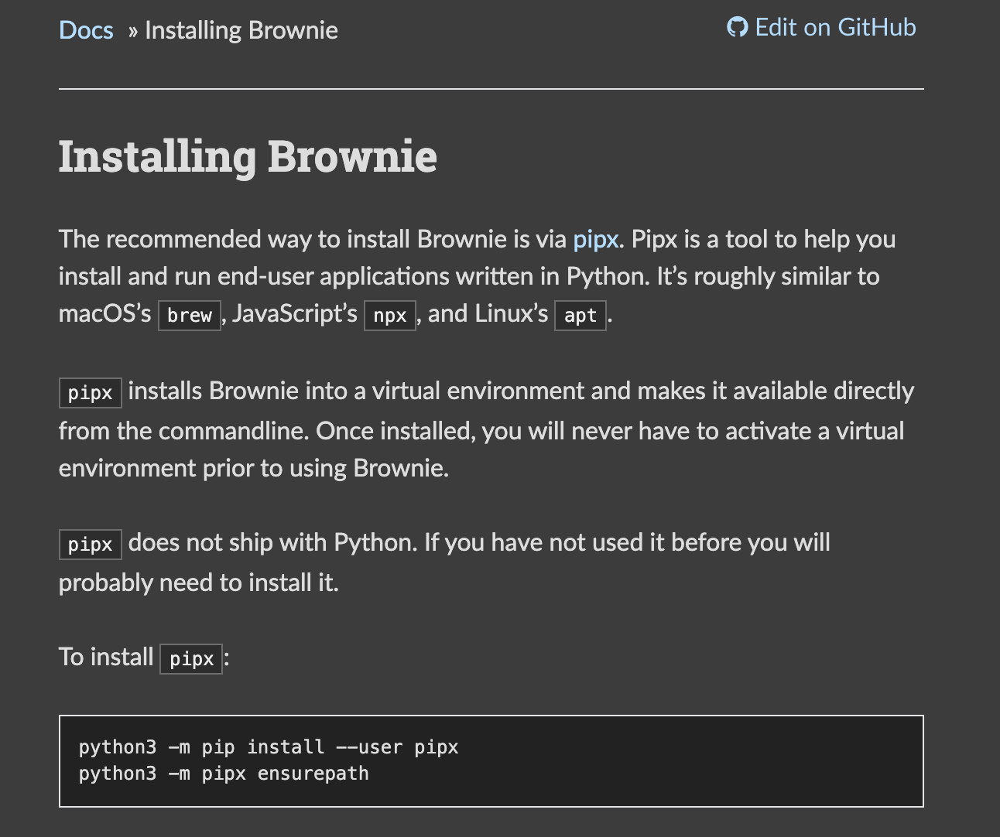
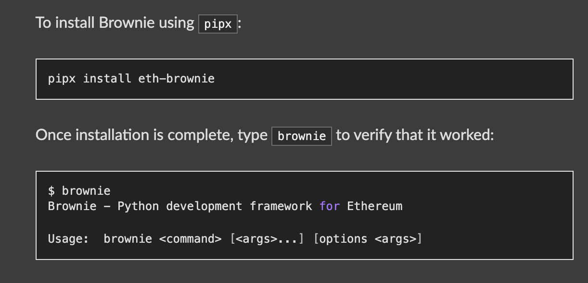
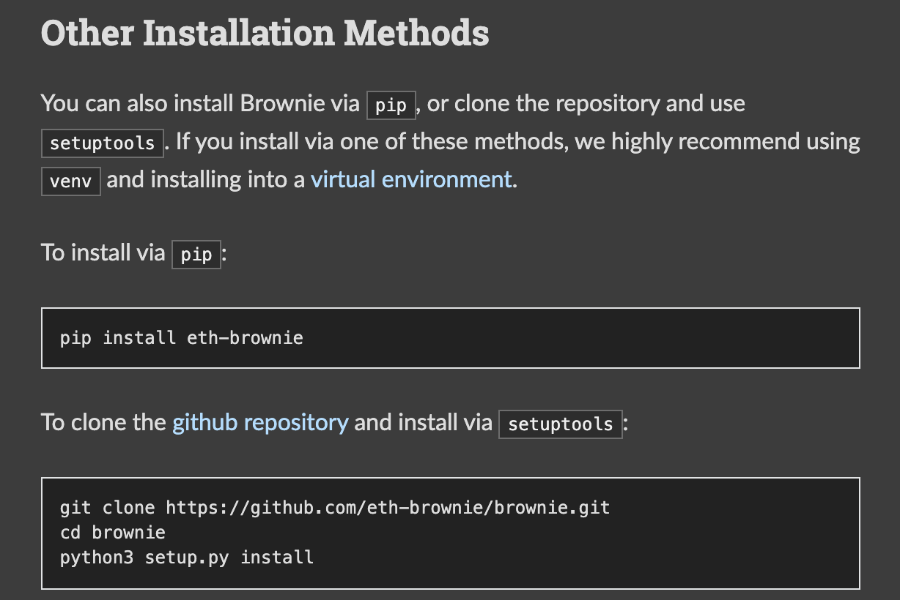
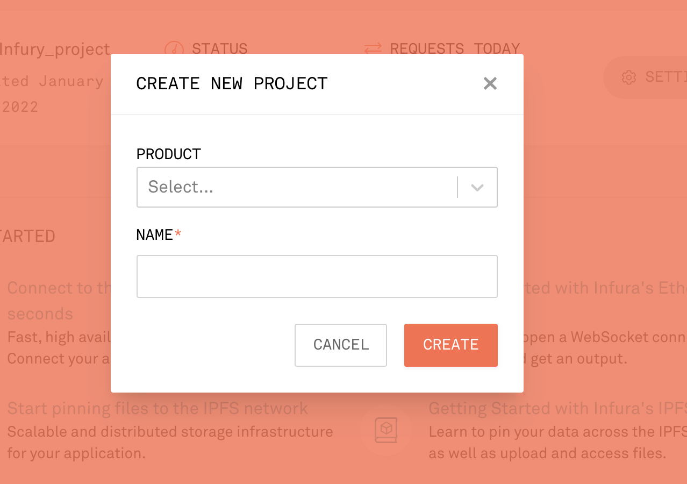
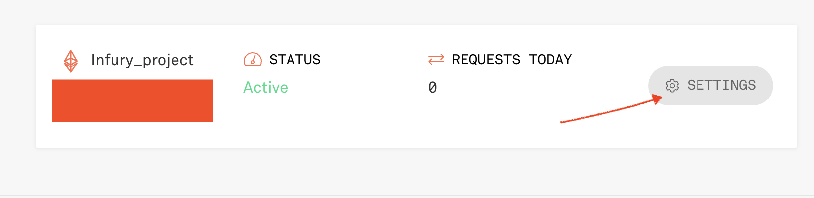
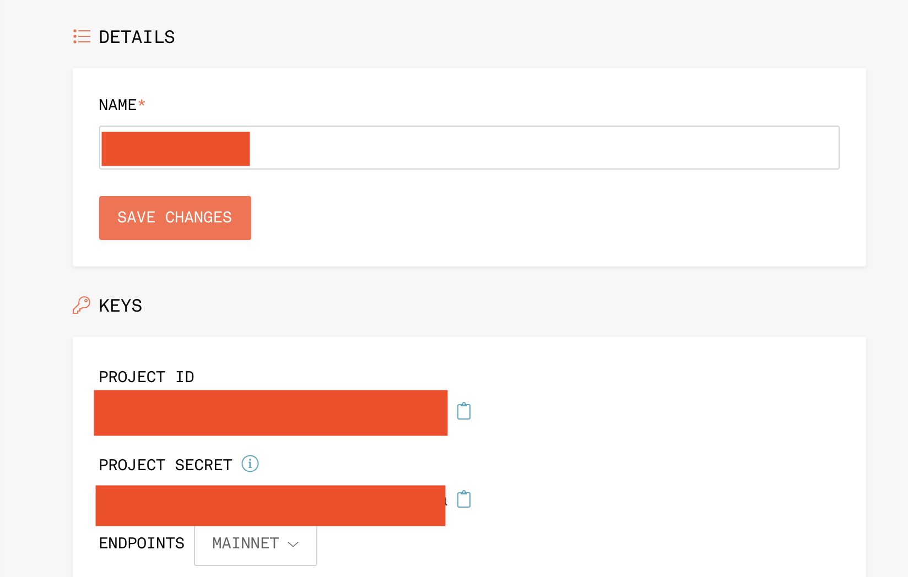

# MiamiFintech_Project3

## Initila Installs for this project 

### Brownie
### Python
### Jnodes
### Infura 

## Install Brownie

### Documentation for Brownie

### Brownie is best installed by using Pipx. Pipx is a tool to help you install and run end-user applications written in Python

### Alternatively you can use these other methods 

## Create an Infura Account 
### Infure provides developers and enterprises with simple, reliable access to Web3 tools and infrastructure. In layman's term it is a way to connect to the blockchain 

### To use Infure, first you will have to create a new project 

### Once your project is created you will need to obtain your private key and project ID, to do so, go to setting 

### Once in the settings tab, you will see the name of your project and can obtain your secret key and your project ID

